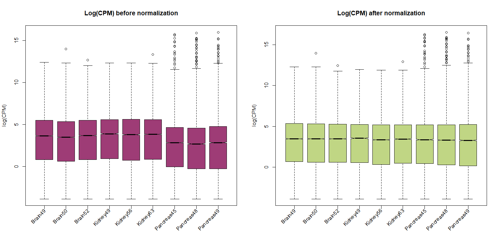
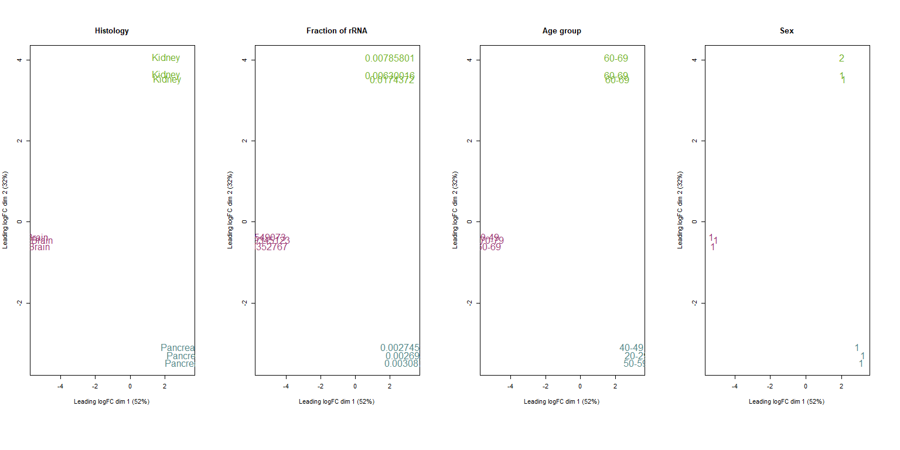
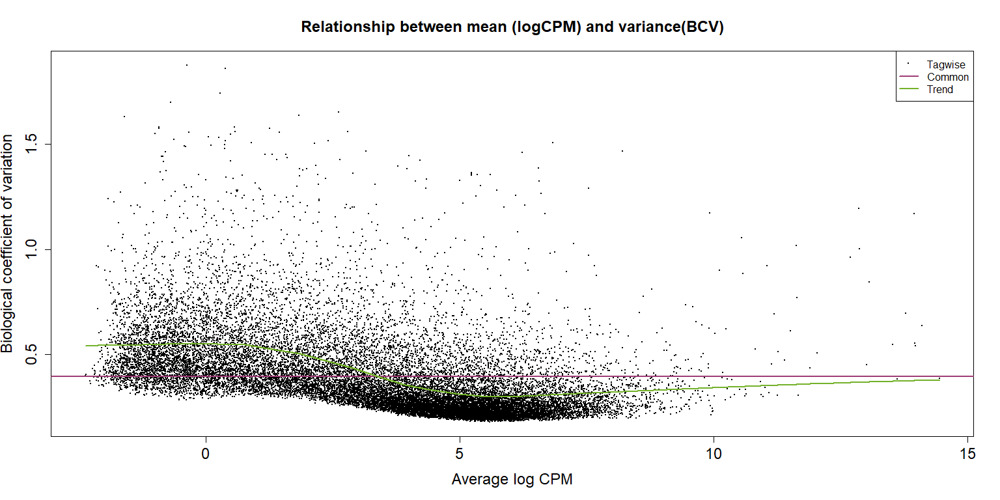
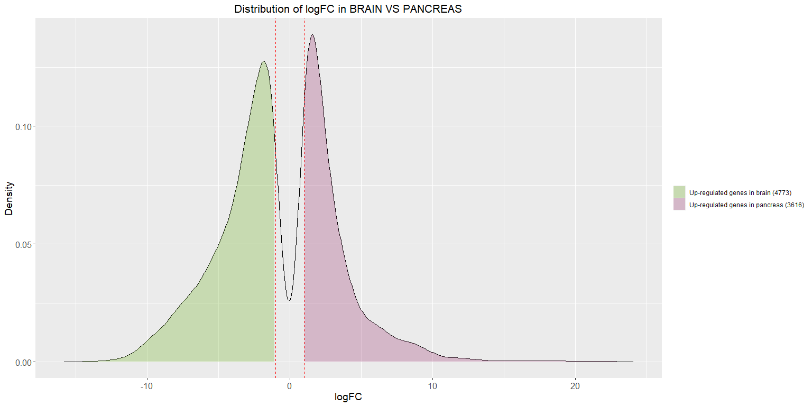
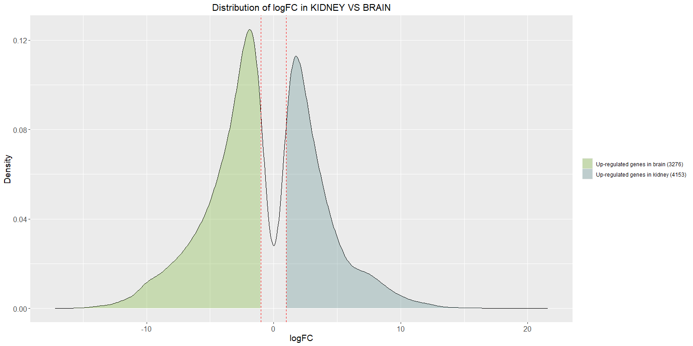
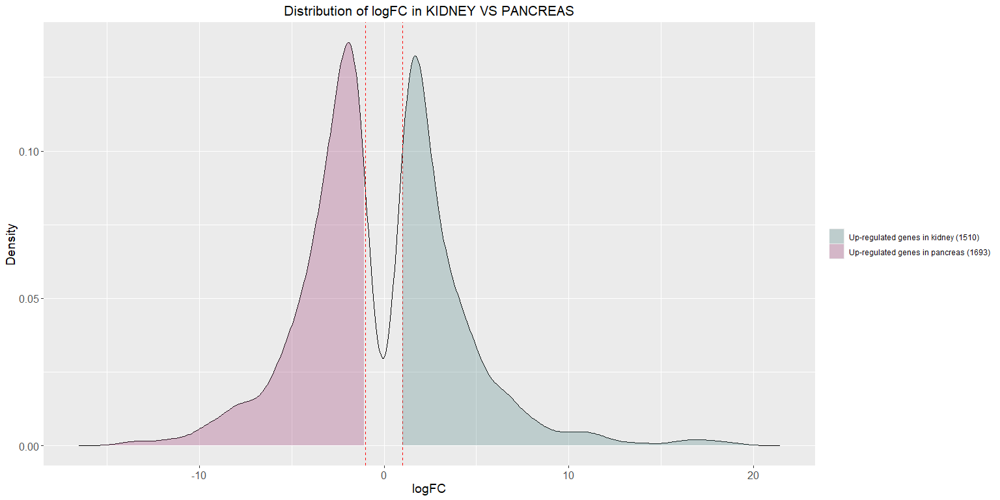
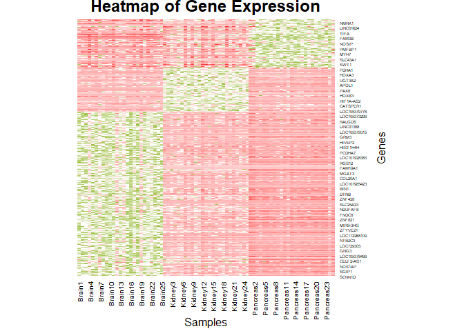
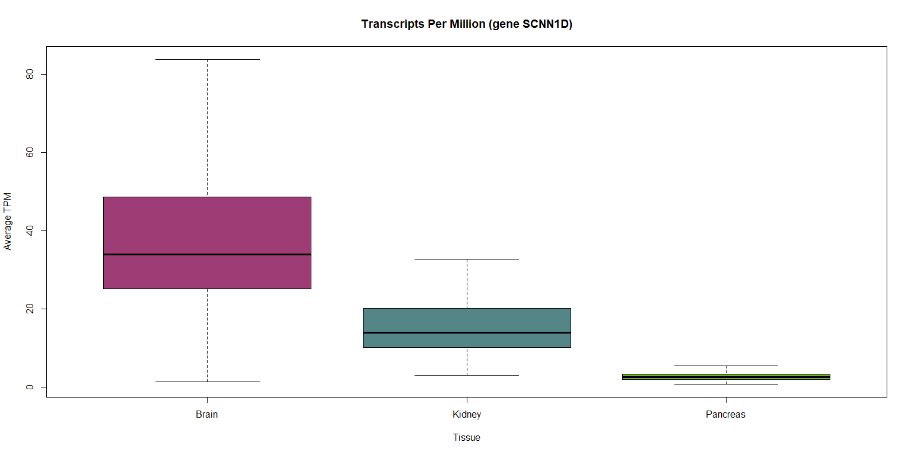
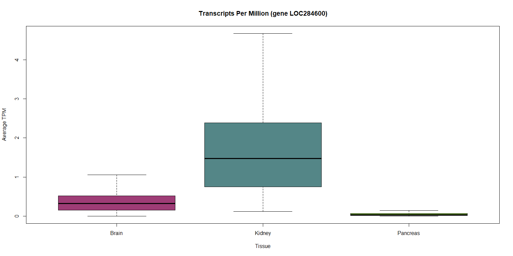
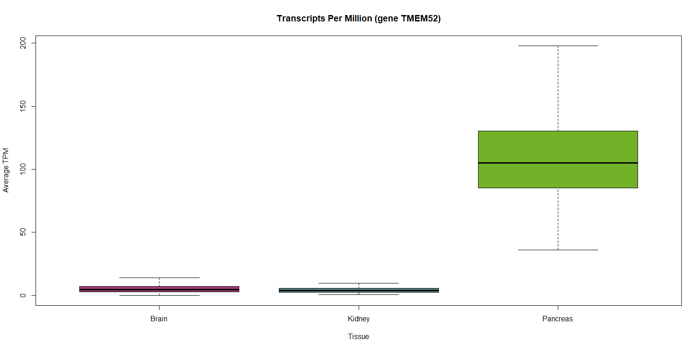

BulkRNA analysis
================
Flavia Leotta
2025-11-27

# Differentially expressed genes between human brain, kidney and pancreas tissue

This report aims to show how to obtain the results of BulkRNA
transcriptomics analysis on tissues samples: this code was used for one
part of the Transcriptomics exam (Prof. Giulio Pavesi) taken by Flavia
Leotta at the University of Milan in June 2024, which comprehended two
presentations, one on bulkRNA and another on scRNA analysis.

Specifically, this report uses data from Gtex project (processed by
Recount3), available at the following link
<http://159.149.160.56/GT_2022_GTEX/>. The tissues chosen, whose .RDS
files are downloaded in the current directory, are:

- `rse_brain.RDS`
- `rse_pancreas.RDS`
- `rse_kidney.RDS`

## 0. Necessary libraries

The analysis is performed on RStudio (v2025.09.0+387, R v4.4.2) using
the following libraries:

``` r
library(recount3) # v1.16.0
library(recount) # v1.32.0
library(edgeR) # v4.4.2
library(ggplot2) # v4.0.1
library(patchwork) # v1.3.2

rse_brain <- readRDS("rse_brain.RDS")
rse_kidney <- readRDS("rse_kidney.RDS")
rse_pancreas <- readRDS("rse_pancreas.RDS")
```

## 1. Choosing 3 patients for each tissue

For the analysis, we choose 3 different patients for each tissue. The
choice depends on the quality of the data, which is evaluated with
metrics:

- RIN (default threshold = 6.0). Checked running
  `colData(<RDS_FILE>)$gtex.smrin[<SAMPLE_NUMBER>]`;
- % of rRNA (default threshold = 5%). Checked running
  `colData(<RDS_FILE>)$gtex.smrrnart[<SAMPLE_NUMBER>]`;
- % of uniquely mapped reads (default threshold = 80). Checked running
  `colData(<RDS_FILE>)$"recount_qc.star.uniquely_mapped_reads_%_both"[<SAMPLE_NUMBER>]`.

We can explore the distribution of these metrics to set customized
thresholds:

<!-- -->

<<<<<<< HEAD
From these plots, we can raise the RIN threshold to 6.5 and the
=======
df_smrrnart <- data.frame(
  Tissue = rep(c("Brain", "Kidney", "Pancreas"),
               times = c(ncol(rse_brain), ncol(rse_kidney), ncol(rse_pancreas))),
  Value = c(
    colData(rse_brain)$gtex.smrrnart,
    colData(rse_kidney)$gtex.smrrnart,
    colData(rse_pancreas)$gtex.smrrnart
  ),
  Metric = "rRNA%"
)

df_unique <- data.frame(
  Tissue = rep(c("Brain", "Kidney", "Pancreas"),
               times = c(ncol(rse_brain), ncol(rse_kidney), ncol(rse_pancreas))),
  Value = c(
    colData(rse_brain)$"recount_qc.star.uniquely_mapped_reads_%_both",
    colData(rse_kidney)$"recount_qc.star.uniquely_mapped_reads_%_both",
    colData(rse_pancreas)$"recount_qc.star.uniquely_mapped_reads_%_both"
  ),
  Metric = "Uniquely Mapped Reads (%)"
)

df_all <- rbind(df_rin, df_smrrnart, df_unique)
tissue_colors <- c("Brain" = "#9E3C76", "Kidney" = "#73B129", "Pancreas" = "#548687")

plot_rin <- ggplot(df_rin, aes(x = Tissue, y = Value, fill = Tissue)) +
  geom_violin(trim = FALSE, color = "gray40") +
  geom_boxplot(width = 0.1, fill = "white", outlier.size = 0.5) +
  scale_fill_manual(values = tissue_colors) +
  labs(title = "RIN", y = "RIN value") +
  theme_minimal(base_size = 14) +
  theme(legend.position = "none")

plot_smrrnart <- ggplot(df_smrrnart, aes(x = Tissue, y = Value, fill = Tissue)) +
  geom_violin(trim = FALSE, color = "gray40") +
  geom_boxplot(width = 0.1, fill = "white", outlier.size = 0.5) +
  scale_fill_manual(values = tissue_colors) +
  labs(title = "rRNA%", y = "rRNA percentage") +
  theme_minimal(base_size = 14) +
  theme(legend.position = "none")

plot_unique <- ggplot(df_unique, aes(x = Tissue, y = Value, fill = Tissue)) +
  geom_violin(trim = FALSE, color = "gray40") +
  geom_boxplot(width = 0.1, fill = "white", outlier.size = 0.5) +
  scale_fill_manual(values = tissue_colors) +
  labs(title = "Uniquely Mapped Reads (%)", y = "% uniquely mapped reads") +
  theme_minimal(base_size = 14) +
  theme(legend.position = "none")

combined_plot <- plot_rin / plot_smrrnart / plot_unique +
  plot_layout(heights = c(5, 5, 5)) +
  plot_annotation(
    title = "Quality Metrics Distribution by Tissue",
    theme = theme(plot.title = element_text(size = 18, face = "bold", hjust = 0.5))
  )
combined_plot
```

<!-- --> From
these plots, I decided to raise the RIN threshold to 6.5 and the
>>>>>>> ccfe4be826bdc65a883ade0f6bf4f505837494ad
percentage of uniquely mapped reads to 85%. The selected patients have
the following characteristics:

| Metric | Brain_1 | Brain_2 | Brain_3 | Kidney_1 | Kidney_2 | Kidney_3 | Pancreas_1 | Pancreas_2 | Pancreas_3 |
|:---|:--:|:--:|:--:|:--:|:--:|:--:|:--:|:--:|:--:|
| Sample ID | 49 | 50 | 52 | 49 | 56 | 63 | 45 | 48 | 49 |
| RIN | 6.8 | 6.7 | 7.4 | 7.3 | 7.8 | 8.0 | 7.6 | 7.5 | 7.1 |
| %rRNA | 3.5 | 5.5 | 3.4 | 0.6 | 1.7 | 0.8 | 0.3 | 0.3 | 0.3 |
| %mapped | 91.5 | 92.0 | 88.9 | 92.9 | 89.7 | 89.9 | 86.0 | 86.7 | 86.5 |

## 1. Preprocessing: transform and clean the data

The numbers in the ‘count table’ are not reads count: they are, more or
less, the average of the coverage on genes’ exons. The datasets need to
be transformed using the following function:

``` r
assays(rse_brain)$counts <- transform_counts(rse_brain)
assays(rse_kidney)$counts <- transform_counts(rse_kidney)
assays(rse_pancreas)$counts <- transform_counts(rse_pancreas)
```

Now, the datasets need to be cleaned: we are going to remove
pseudogenese, rRNA, genes annotated on the mitochondrion and genes
shorter than 200 bp. We are going to show the code used to clean up the
brain tissue sample, but the same procedure will be applied to the other
two tissue datasets as well.

``` r
# Remove 24 mitochondria genes
to_filter <- rowRanges(rse_brain)$gene_id[as.character(seqnames(rowRanges(rse_brain))) == "chrM"]
new_rse_brain <- rse_brain[!rownames(rowData(rse_brain)) %in% to_filter,]

# Remove 7415 pseudogenes
valid_rows <- !is.na(rowData(new_rse_brain)$gene_biotype)
valid_rows <- new_rse_brain[valid_rows, ]

new_rse_brain <- new_rse_brain[!rownames(rowData(new_rse_brain)) %in% rownames(valid_rows),]

# Remove 54 rRNA genes
valid_rows <- !is.na(rowData(new_rse_brain)$gbkey)
valid_rows <- new_rse_brain[valid_rows, ]

new_rse_brain <- new_rse_brain[!rownames(rowData(new_rse_brain)) %in% rownames(valid_rows[rowData(valid_rows)$gbkey == "rRNA"])]

# Remove 5646 genes < 200 bp long
new_rse_brain <- new_rse_brain[!rownames(rowData(new_rse_brain)) %in% rownames(new_rse_brain[rowData(new_rse_brain)$bp_length < 200])]
```

For each tissue we are left with datasets containing a total of 40903
genes. The next pre-processing step involves deletion of ‘non-canonical’
genes:

``` r
canonical_rse_brain <- new_rse_brain[grepl("chr", rowRanges(new_rse_brain)@seqnames, ignore.case = TRUE)]
canonical_rse_kidney <- new_rse_kidney[grepl("chr", rowRanges(new_rse_kidney)@seqnames, ignore.case = TRUE)]
canonical_rse_pancreas <- new_rse_pancreas[grepl("chr", rowRanges(new_rse_pancreas)@seqnames, ignore.case = TRUE)]
```

Now we’re left with 36179 genes for each tissue.

## 2. Prepare the dataset object for the analysis

To perform the analysis, we want to organise the data in a DGEList
object with a few, selected, characteristics, a subset of those
contained in the RDS files. First, we keep only the columns of the
samples we selected and create count tables only for those.

``` r
rse_brain_selected <- canonical_rse_brain[,c(49,50,52)]
rse_kidney_selected <- canonical_rse_kidney[,c(49,56,63)]
rse_pancreas_selected <- canonical_rse_pancreas[,c(45,48,49)]

counts_brain_selected <- assays(rse_brain_selected)$counts
counts_kidney_selected <- assays(rse_kidney_selected)$counts
counts_pancreas_selected <- assays(rse_pancreas_selected)$counts
```

The tables can be bound together to create a total count table were the
column names are `<Tissue><SAMPLE_NUMBER>` and row names are the genes’
names. Then the final count table can be converted in an EdgeR object.

``` r
x <- cbind(counts_brain_selected,counts_kidney_selected,counts_pancreas_selected)
colnames(x) <- c("Brain49", "Brain50","Brain52","Kidney49", "Kidney56","Kidney63","Pancreas45","Pancreas48","Pancreas49")
rownames(x) <- rowData(rse_brain_selected)$gene_name
y <- DGEList(counts=x)
```

Then, we assign each sample to a group depending on the histology and
transform dataset information in factors (RIN, tissue slice, sex, age,
rRNA, %of mapped reads, chromosomes information).

``` r
group <- as.factor(c("Brain","Brain","Brain","Kidney","Kidney","Kidney","Pancreas","Pancreas","Pancreas"))
y$samples$group <- group 

y$samples$rin <- as.factor(c(colData(rse_brain_selected)$gtex.smrin,colData(rse_kidney_selected)$gtex.smrin,colData(rse_pancreas_selected)$gtex.smrin))
y$samples$slice <- as.factor(c(colData(rse_brain_selected)$gtex.smtsd,colData(rse_kidney_selected)$gtex.smtsd,colData(rse_pancreas_selected)$gtex.smtsd))
y$samples$sex <- as.factor(c(colData(rse_brain_selected)$gtex.sex,colData(rse_kidney_selected)$gtex.sex,colData(rse_pancreas_selected)$gtex.sex))
y$samples$age <- as.factor(c(colData(rse_brain_selected)$gtex.age,colData(rse_kidney_selected)$gtex.age,colData(rse_pancreas_selected)$gtex.age))
y$samples$rRNA <- as.factor(c(colData(rse_brain_selected)$gtex.smrrnart,colData(rse_kidney_selected)$gtex.smrrnart,colData(rse_pancreas_selected)$gtex.smrrnart))
y$samples$mapped <- as.factor(c(colData(rse_brain_selected)$"recount_qc.star.uniquely_mapped_reads_%_both", colData(rse_kidney_selected)$"recount_qc.star.uniquely_mapped_reads_%_both",colData(rse_pancreas_selected)$"recount_qc.star.uniquely_mapped_reads_%_both"))
y$samples$chrm <- as.factor(c(colData(rse_brain_selected)$"recount_qc.aligned_reads%.chrm", colData(rse_kidney_selected)$"recount_qc.aligned_reads%.chrm",colData(rse_pancreas_selected)$"recount_qc.aligned_reads%.chrm"))
```

The resulting dataset will be a large DGEList object:

``` r
y
```

    ## An object of class "DGEList"
    ## $counts
    ##             Brain49 Brain50 Brain52 Kidney49 Kidney56 Kidney63 Pancreas45
    ## DDX11L1           7       9       2        8       17        8          6
    ## WASH7P         1236     718     583     1606     1568     1287        738
    ## MIR1302-2HG       1       6      11        5        5        2          0
    ## FAM138A           0       3       0        1        0        0          0
    ## OR4F5             0       0       0        0        0        0          0
    ##             Pancreas48 Pancreas49
    ## DDX11L1              7          9
    ## WASH7P            1050        980
    ## MIR1302-2HG          1          0
    ## FAM138A              0          0
    ## OR4F5                1          0
    ## 36174 more rows ...
    ## 
    ## $samples
    ##               group lib.size norm.factors rin                        slice sex
    ## Brain49       Brain 25153738            1 6.8               Brain - Cortex   1
    ## Brain50       Brain 28604282            1 6.7          Brain - Hippocampus   1
    ## Brain52       Brain 27566526            1 7.4 Brain - Frontal Cortex (BA9)   1
    ## Kidney49     Kidney 30883795            1 7.3              Kidney - Cortex   1
    ## Kidney56     Kidney 27484915            1 7.8              Kidney - Cortex   1
    ## Kidney63     Kidney 27179634            1   8              Kidney - Cortex   2
    ## Pancreas45 Pancreas 32291346            1 7.6                     Pancreas   1
    ## Pancreas48 Pancreas 31791341            1 7.5                     Pancreas   1
    ## Pancreas49 Pancreas 31240614            1 7.1                     Pancreas   1
    ##              age       rRNA mapped  chrm
    ## Brain49    60-69  0.0352767   91.5 23.09
    ## Brain50    40-49  0.0549073     92 18.88
    ## Brain52    70-79  0.0345123   88.9 19.56
    ## Kidney49   60-69 0.00630016   92.9 10.16
    ## Kidney56   60-69  0.0174372   89.7 17.54
    ## Kidney63   60-69 0.00785801   89.9 20.08
    ## Pancreas45 40-49 0.00274531     86  4.66
    ## Pancreas48 50-59 0.00308729   86.7  4.31
    ## Pancreas49 20-29 0.00269891   86.5  6.74

## 3. Removing non-differentialy expressed genes and Normalization

Since the goal of our analysis is to compare differentially expressed
genes between three different tissues, it follows that analyzing genes
that are not (or just low) expressed in all of the samples is
unnecessary. We can check how many genes are not expressed at all in our
dataset with `table(rowSums(y$counts==0)==9)`, and filter those out, but
package edgeR comes with an handy function (`filterByExpr()`) that does
it automatically.

``` r
keep.exprs <- filterByExpr(y, group=group)
y <- y[keep.exprs,, keep.lib.sizes=FALSE]
```

Now we are left with 21950 genes: in a normal transcriptomics workflow,
genes’ counts per million (CPM) values need to be normalized using TMM,
the trimmed mean of M-values method proposed by Robinson and Oshlack
(2010). To better visualize the process behind normalization, we plot
boxplot of Log(CPM) before and after normalization.

``` r
# Store into a vector the log(CPM) before normalization
logcpm_before <- cpm(y, log=TRUE)

# Normalization
y <- calcNormFactors(y, method = "TMM")

# Store into a vector the log(CPM) after normalization
logcpm_after <- cpm(y, log=TRUE)
```

<!-- -->

Now, after normalization, we can see that the median log(CPM) is on the
same value for all of the samples.

## 4. Check for correlation

We can check if tissues are correlated by ensuring that we are not
working with subtypes of cells. To do so, we create a linear model of
the following type:

$$Y_{gene} = \beta_1 \cdot Tissue_1 + \beta_2 \cdot Tissue_2 + \beta_3 \cdot Tissue_3 + \epsilon$$
where $Y_{gene}$ is the (normalized) expression of a gene, **Tissue** is
a variable indicating to which group each sample belongs (1 = belong, 0
= doesn’t) and the coefficients $\beta$ are estimated by the model and
represent the **average expression of the gene** in each tissue.
$\epsilon$ represents the residual error. The function `model.matrix()`
builds a design matrix, a numerical representation of the model: we want
independents tissues, where each sample belongs to only one group and
none of the columns (tissues) can be expressed as a combination of the
others. This ensures that none of the tissues we are working with are a
subtype or a linear combination of of the others, in other words there
is no collinearity in our model, which would make gene expression
comparison unrealiable.

``` r
design <- model.matrix(~0+group, data=y$samples)
colnames(design) <- levels(y$samples$group)
design
```

    ##            Brain Kidney Pancreas
    ## Brain49        1      0        0
    ## Brain50        1      0        0
    ## Brain52        1      0        0
    ## Kidney49       0      1        0
    ## Kidney56       0      1        0
    ## Kidney63       0      1        0
    ## Pancreas45     0      0        1
    ## Pancreas48     0      0        1
    ## Pancreas49     0      0        1
    ## attr(,"assign")
    ## [1] 1 1 1
    ## attr(,"contrasts")
    ## attr(,"contrasts")$group
    ## [1] "contr.treatment"

Every sample shows “1” in the colum of its tissue, and “0” in the
others, confirming absence of collinearity.

We want also to ensure that the samples with the same histology are
similar between each other because of gene expression and not due to
other factors (i.e. age, sex, etc…). To check this, we use
Multidimensional scaling (MDS) plots of distances between gene
expression profiles using function `plotMDS()` from package `limma`:
this function creates 2D plots that approximate the typical log2 fold
changes between samples. In synthesis, if two samples are close to each
other in the plots, their log2 fold changes values are similar, meaning
they share similar gene expression patterns.

<!-- -->

Note: in the plot stating sex of patient, 1 stands for men and 2 for
women.

From these plots, we can see that the samples divide in three distinct
clusters, depending on the histology of the tissue: no other
characteristic can explain their grouping.

## 5. Model read counts

Read counts need to be modeled using a distribution: theoretically
speaking, the Poisson distribution could be used, but it assumes that
mean and variance of gene expression are equal, which is not true for
RNA-Seq. Lowly expressed genes have, in fact, a much higher variance
than highly expressed genes, due to biological variation.

As described in Chen, Yunshun & Lun, Aaron & Smyth, Gordon. (2016) (doi
10.12688/f1000research.8987.2), `edgeR` uses the negative binomial (NB)
distribution to model the read counts for each gene in each sample. The
dispersion parameter of the NB distribution accounts for variability
between biological replicates: the square root of this quantity is
called Biological Coefficient of Variation (BCV). For RNA-seq studies,
the NB dispersions tend to be higher for genes with very low counts and
decrease smoothly to a constant value for genes with larger counts.

BCV reflects biological variation of genic expression, and NB is able to
model it, better than Poisson distribution: the bigger is biological
variability in the data, the greater is BCV and thus the discrepancy
between data and a Poisson distribution.It can be proven as the variance
approach to the mean, the NB model becomes the Poisson model. To
visualize this discrepancy, we can use estimate the distribution and
then plot function `plotBCV()`:

``` r
y <- estimateDisp(y, design)

plotBCV(y, col.common = colors[1], col.trend = colors[2], main= "Relationship between mean (logCPM) and variance(BCV)", lwd = 5,
        cex.main = 1.5, cex.lab = 1.5, cex.axis = 1.5, cex.legend = 1.5)
```

<!-- -->

## 6. Identifying differentially expressed genes

Now, it is possible to extend the NB model using wuasi-likelihood (QL)
methods to account for gene-specific variability: NB dispersion can be
used to describe the overall biological variability, qhile gene-specific
variation aboce and below the overall level is picked up by the QL
dispersion.

``` r
fit <- glmQLFit(y, design)

# Order:
# 1. Brain      2. Kidney        3. Pancreas
# Top: reference, Bottom: the compared one

#kidney (top) vs brain (bottom)
qlfKB <- glmQLFTest(fit, contrast=c(-1,1,0))
#pancreas (top) vs brain (bottom)
qlfPB <- glmQLFTest(fit, contrast=c(-1,0,1))
#pancreas (top) vs kidney (bottom)
qlfPK <- glmQLFTest(fit, contrast=c(0,-1,1))
```

These results can be explored by setting a LFC (Log Fold-change) and a
p-value threshold: we set Log-FC threshold to 1 and p-value to 0.01, but
these quantities can be changed to account for studies limitations and
research question.

    ##        -1*Brain 1*Kidney
    ## Down                4135
    ## NotSig             14539
    ## Up                  3276

    ##        -1*Brain 1*Pancreas
    ## Down                  4773
    ## NotSig               13561
    ## Up                    3616

    ##        -1*Kidney 1*Pancreas
    ## Down                   1693
    ## NotSig                18747
    ## Up                     1510

The results are:

- There are 4153 genes under-expressed and 3276 over-expressed in the
  Brain in comparison to the Kidney;
- There are 4773 genes under-expressed and 3616 over-expressed in the
  Brain in comparison to the Pancreas;
- There are 1693 genes under-expressed and 1510 over-expressed in the
  Kidney in comparison to the Pancreas.

<!-- --><!-- --><!-- -->
Now that we have comparison between tissues, we can intersect these
results to find how many genes are up-regulated in each tissue across
all comparisons. We are going to show the code used for the brain, but
the same applies to kidney and pancreas.

``` r
# Report all genes up-regulated in brain against pancreas and kidney

# First comparison: Genes up-regulated brain vs pancreas
resultsPB <- topTags(qlfPB, n = 10000000, adjust.method = "BH", sort.by = "PValue", p.value = 1)
PBtest <- decideTests(qlfPB, p.value=0.01, adjust.method = "BH",lfc=1)
FDR_compliant <- rownames(resultsPB[resultsPB@.Data[[1]]$FDR < 0.01,])

upregulated_PB <- rownames(PBtest)[PBtest == -1]
upregulated_PB_FDR_compliant <- intersect(upregulated_PB, FDR_compliant)

# Second comparison: Genes up-regulated brain vs kidney
resultsKB <- topTags(qlfKB, n = 10000000, adjust.method = "BH", sort.by = "PValue", p.value = 1)
KBtest <- decideTests(qlfKB, p.value=0.01, adjust.method = "BH",lfc=1)
FDR_compliant <- rownames(resultsKB[resultsKB@.Data[[1]]$FDR < 0.01,])

upregulated_KB <- rownames(KBtest)[KBtest == -1]
upregulated_KB_FDR_compliant <- intersect(upregulated_KB, FDR_compliant)

# Genes up-regulated in both
brain_upregulated <- intersect(upregulated_PB_FDR_compliant,upregulated_KB_FDR_compliant)
length(brain_upregulated) # 3391
```

    ## [1] 3391

We obtained 3391 genes up-regulated in the brain. With a similar
approach, we identify 1001 genes upregulated in the pancreas and 910 in
the kidney. Now, we want to check if these results depend on the 3
patients that were chosen or if the same behavior can be observed in the
rest: we obtain the counts from everyone using the following code to
create a custom dataset:

``` r
x_mine <- c(brain_upregulated, kidney_upregulated, pancreas_upregulated)

counts_brain <- assays(canonical_rse_brain[rowData(canonical_rse_brain)$gene_name %in% x_mine ])$counts
counts_kidney <- assays(canonical_rse_kidney[rowData(canonical_rse_kidney)$gene_name %in% x_mine ])$counts
counts_pancreas <- assays(canonical_rse_pancreas[rowData(canonical_rse_pancreas)$gene_name %in% x_mine ])$counts

samples_brain <- length(colnames(rse_brain)) # We have 2931 patients in the brain tissue dataset
samples_kidney <- length(colnames(rse_kidney)) # We have 98 patients in the kidney tissue dataset
samples_pancreas <- length(colnames(rse_pancreas)) # We have 360 patients in the pancreas tissue dataset

names_brain <- character(length = samples_brain)
for (i in seq_along(names_brain)) {
  name <- paste("Brain",i, sep="")
  names_brain[i] <- name
}

names_kidney <- character(length = samples_kidney)
for (i in seq_along(names_kidney)) {
  name <- paste("Kidney",i, sep="")
  names_kidney[i] <- name
}

names_pancreas <- character(length = samples_pancreas)
for (i in seq_along(names_pancreas)) {
  name <- paste("Pancreas",i, sep="")
  names_pancreas[i] <- name
}


# create total count table by binding the count tables together
x <- cbind(counts_brain,counts_kidney,counts_pancreas)
colnames(x) <- c(names_brain, names_kidney, names_pancreas)
rownames(x) <- rowData(canonical_rse_brain[rowData(canonical_rse_brain)$gene_name %in% x_mine ])$gene_name
```

Since we are extracting count values from the original dataset files,
the new dataset has to again be transformed in a DGEList object and
normalised.

``` r
y <- DGEList(counts=x) #EdgeR, Object that contains the count table.

# Let's divide samples into groups according to the histology (before they were part of the same group)
one <- rep("brain", times=2931)
two <- rep("kidney", times = 98) 
three <- rep("pancreas", times = 360)
group <- as.factor(c(one, two, three))
y$samples$group <- group

y <- calcNormFactors(y, method = "TMM")
```

And after a few adjustments for visualization purposes (i.e. ordering of
the genes), we can plot a heatmap:

<!-- -->

Colors represent gene expression: green show up-regulated genes, while
pink-red represents low to down regulated genes. Clear clustering
support the theory that the previously identified genes show expression
patterns due to histology, and are not due to patient-related
variability.

# 7. Functional enrichment

In order to perform functional enrichment, we save our results in .txt
files with `write.table()`, from which we can obtain the top
differentially expressed (DE) genes. We can see how the expression of
the top gene for each tissue differs between them:

``` r
assays(canonical_rse_brain)$TPM <- recount::getTPM(canonical_rse_brain)
assays(canonical_rse_kidney)$TPM <- recount::getTPM(canonical_rse_kidney)
assays(canonical_rse_pancreas)$TPM <- recount::getTPM(canonical_rse_pancreas)
number_brain <- which(rowData(canonical_rse_brain)$gene_name == "SCNN1D")
number_kidney <- which(rowData(canonical_rse_brain)$gene_name == "LOC284600")
number_pancreas <- which(rowData(canonical_rse_brain)$gene_name == "TMEM52")

boxplot(assays(canonical_rse_brain)$TPM[number_brain,],
        assays(canonical_rse_kidney)$TPM[number_brain,],
        assays(canonical_rse_pancreas)$TPM[number_brain,],
        outline=F,
        col = c(colors[1], colors[3], colors[2]),
        main = "Transcripts Per Million (gene SCNN1D)",
        xlab = "Tissue",
        ylab = "Average TPM",
        names = c("Brain", "Kidney", "Pancreas"))
```

<!-- -->

``` r
boxplot(assays(canonical_rse_brain)$TPM[number_kidney,],
        assays(canonical_rse_kidney)$TPM[number_kidney,],
        assays(canonical_rse_pancreas)$TPM[number_kidney,],
        outline=F,
        col = c(colors[1], colors[3], colors[2]),
        main = "Transcripts Per Million (gene LOC284600)",
        xlab = "Tissue",
        ylab = "Average TPM",
        names = c("Brain", "Kidney", "Pancreas"))
```

<!-- -->

``` r
boxplot(assays(canonical_rse_brain)$TPM[number_pancreas,],
        assays(canonical_rse_kidney)$TPM[number_pancreas,],
        assays(canonical_rse_pancreas)$TPM[number_pancreas,],
        outline=F,
        col = c(colors[1], colors[3], colors[2]),
        main = "Transcripts Per Million (gene TMEM52)",
        xlab = "Tissue",
        ylab = "Average TPM",
        names = c("Brain", "Kidney", "Pancreas"))
```

<!-- -->

If, instead, we select the a group of genes (i.e. the first 500 DE
genes) we can investigate the pathways involved in their up-regulation.
To do so, we upload them on Gene Ontology Resource and Enrichr (Human
Gene Atlas). On Gene Ontology we obtain the following results (chosen as
the first ones for Fold enrichment values):

<table>

<thead>

<tr>

<th style="text-align:left;">

Category
</th>

<th style="text-align:left;">

GO.annotation.Brain
</th>

<th style="text-align:left;">

Freq..Brain
</th>

<th style="text-align:right;">

FDR.Brain
</th>

<th style="text-align:left;">

GO.annotation.Kidney
</th>

<th style="text-align:left;">

Freq..Kidney
</th>

<th style="text-align:right;">

FDR.Kidney
</th>

<th style="text-align:left;">

GO.annotation.Pancreas
</th>

<th style="text-align:left;">

Freq..Pancreas
</th>

<th style="text-align:right;">

FDR.Pancreas
</th>

</tr>

</thead>

<tbody>

<tr>

<td style="text-align:left;">

Biological process
</td>

<td style="text-align:left;">

purine deoxyribonucleoside diphosphate biosynthetic process
</td>

<td style="text-align:left;">

2/2
</td>

<td style="text-align:right;">

0.0447
</td>

<td style="text-align:left;">

pronephric field specification
</td>

<td style="text-align:left;">

2/2
</td>

<td style="text-align:right;">

0.0197
</td>

<td style="text-align:left;">

exocrine pancreas development
</td>

<td style="text-align:left;">

5/10
</td>

<td style="text-align:right;">

2.31e-03
</td>

</tr>

<tr>

<td style="text-align:left;">

Molecular function
</td>

<td style="text-align:left;">

G protein-coupled photoreceptor activity
</td>

<td style="text-align:left;">

4/15
</td>

<td style="text-align:right;">

0.0227
</td>

<td style="text-align:left;">

polyspecific organic cation:proton antiporter activity
</td>

<td style="text-align:left;">

2/2
</td>

<td style="text-align:right;">

0.0329
</td>

<td style="text-align:left;">

alpha-amylase activity
</td>

<td style="text-align:left;">

5/5
</td>

<td style="text-align:right;">

1.73e-05
</td>

</tr>

<tr>

<td style="text-align:left;">

Cellular component
</td>

<td style="text-align:left;">

perineuronal net
</td>

<td style="text-align:left;">

3/10
</td>

<td style="text-align:right;">

0.0191
</td>

<td style="text-align:left;">

platelet alpha granule membrane
</td>

<td style="text-align:left;">

4/17
</td>

<td style="text-align:right;">

0.0131
</td>

<td style="text-align:left;">

Hrd1p ubiquitin ligase ERAD-L complex
</td>

<td style="text-align:left;">

2/2
</td>

<td style="text-align:right;">

2.13e-02
</td>

</tr>

</tbody>

</table>

On Enrichr we obtain:

- for the *brain* tissue, ulterior confirmation that these gene are
  up-regulated exactly in the brain. More precisely, Enrichr is able to
  estimate that these genes can be found in Astrocytes (CellMaker 2024)
  in the Prefrontal cortex (CellMarker 2024 and TISSUES
  Experimental 2025) or Interneurons (PanglaoDB Augmented 2021). These
  upregulated genes are found in pathways involved with Potassium
  Channels activity (Reactome Pathways 2024), production of Potassium as
  metabolite (HMDB Metabolites) and Aldosterone synthesis and secretion
  (KEGG 2021 Human);
- for the *kidney* tissue, these genes can be found in Tubular
  Epithelial cells (TEC) of the Glomerulus (Cell Marker 2024), more
  specifically Distal Tubule Cells (PanglaoDB Augmented 2021) of the
  Kidney (TISSUES Curated 2025). They are upregulated genes involved in
  Kidney Development (Reactome Pathways 2024) and Aldosterone-regulted
  sodium reabsorption (KEGG 2021 Human);
- for the *pancreas* tissue. These genes are upregulated in
  L13a-mediated Translational Silencing of Ceruloplasmin Expression
  pathway (Reactome Pathways 2024) and Pancreatic secretion (KEGG 2021
  Human). They can be found in Acinar Cells (PanglaoDB Augmented 2021)
  in the Pancreatic (Human Gene Atlas, TISSUES curated 2025) Islets
  (CellMarker 2024).

## 8. Conclusion

We were able to find differentially expressed genes (DE) from bulk
RNA-seq data of three human tissues: brain, kidney and pancreas. We
identified 3391 up-regulated genes in the brain, 910 in the kidney and
1001 in the pancreas, and performed functional enrichment to examine in
which pathways they are involved. This type of analysis can be useful to
answer many research questions, and I hope my Markdown report can be
useful for who is reading it.

For inquiries (or to even drop a comment) please don’t hesitate to
contact me on my e-mail: `flavia.leotta@hotmail.com`.
