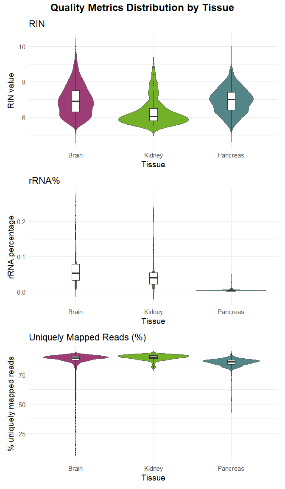

BulkRNA analysis
================
Flavia Leotta
2025-11-26

# Differentially expressed genes between human brain, kidney and pancreas tissue

This report aims to show the results of BulkRNA transcriptomics analysis
on tissues samples: specifically, it uses data from Gtex project
(processed by Recount3), available at the following link
<http://159.149.160.56/GT_2022_GTEX/>. The tissues chosen, whose .RDS
files are downloaded in the current directory, are:

- `rse_brain.RDS`
- `rse_pancreas.RDS`
- `rse_kidney.RDS`

## 0. Necessary libraries

The analysis was performed on RStudio (v2025.09.0+387, R v4.4.2) using
the following libraries:

## 1. Choosing 3 patients for each tissue

For the analysis, I chose 3 different patients for each tissue. The
choice depends on the quality of the data, which is evaluated with
metrics:

- RIN (default threshold = 6.0);
- % of rRNA (default threshold = 5%);
- % of uniquely mapped reads (default threshold = 80).

We can explore the distribution of these metrics to set customized
thresholds:

``` r
df_rin <- data.frame(
  Tissue = rep(c("Brain", "Kidney", "Pancreas"),
               times = c(ncol(rse_brain), ncol(rse_kidney), ncol(rse_pancreas))),
  Value = c(
    colData(rse_brain)$gtex.smrin,
    colData(rse_kidney)$gtex.smrin,
    colData(rse_pancreas)$gtex.smrin
  ),
  Metric = "RIN"
)

df_smrrnart <- data.frame(
  Tissue = rep(c("Brain", "Kidney", "Pancreas"),
               times = c(ncol(rse_brain), ncol(rse_kidney), ncol(rse_pancreas))),
  Value = c(
    colData(rse_brain)$gtex.smrrnart,
    colData(rse_kidney)$gtex.smrrnart,
    colData(rse_pancreas)$gtex.smrrnart
  ),
  Metric = "rRNA%"
)

df_unique <- data.frame(
  Tissue = rep(c("Brain", "Kidney", "Pancreas"),
               times = c(ncol(rse_brain), ncol(rse_kidney), ncol(rse_pancreas))),
  Value = c(
    colData(rse_brain)$"recount_qc.star.uniquely_mapped_reads_%_both",
    colData(rse_kidney)$"recount_qc.star.uniquely_mapped_reads_%_both",
    colData(rse_pancreas)$"recount_qc.star.uniquely_mapped_reads_%_both"
  ),
  Metric = "Uniquely Mapped Reads (%)"
)

df_all <- rbind(df_rin, df_smrrnart, df_unique)
tissue_colors <- c("Brain" = "#9E3C76", "Kidney" = "#73B129", "Pancreas" = "#548687")

plot_rin <- ggplot(df_rin, aes(x = Tissue, y = Value, fill = Tissue)) +
  geom_violin(trim = FALSE, color = "gray40") +
  geom_boxplot(width = 0.1, fill = "white", outlier.size = 0.5) +
  scale_fill_manual(values = tissue_colors) +
  labs(title = "RIN", y = "RIN value") +
  theme_minimal(base_size = 14) +
  theme(legend.position = "none")

plot_smrrnart <- ggplot(df_smrrnart, aes(x = Tissue, y = Value, fill = Tissue)) +
  geom_violin(trim = FALSE, color = "gray40") +
  geom_boxplot(width = 0.1, fill = "white", outlier.size = 0.5) +
  scale_fill_manual(values = tissue_colors) +
  labs(title = "rRNA%", y = "rRNA percentage") +
  theme_minimal(base_size = 14) +
  theme(legend.position = "none")

plot_unique <- ggplot(df_unique, aes(x = Tissue, y = Value, fill = Tissue)) +
  geom_violin(trim = FALSE, color = "gray40") +
  geom_boxplot(width = 0.1, fill = "white", outlier.size = 0.5) +
  scale_fill_manual(values = tissue_colors) +
  labs(title = "Uniquely Mapped Reads (%)", y = "% uniquely mapped reads") +
  theme_minimal(base_size = 14) +
  theme(legend.position = "none")

combined_plot <- plot_rin / plot_smrrnart / plot_unique +
  plot_layout(heights = c(5, 5, 5)) +
  plot_annotation(
    title = "Quality Metrics Distribution by Tissue",
    theme = theme(plot.title = element_text(size = 18, face = "bold", hjust = 0.5))
  )
combined_plot
```

<!-- --> From
these plots, I decided to raise the RIN threshold to 6.5 and the
percentage of uniquely mapped reads to 85%. The selected patients have
the following characteristics:

| Metric | Brain_1 | Brain_2 | Brain_3 | Kidney_1 | Kidney_2 | Kidney_3 | Pancreas_1 | Pancreas_2 | Pancreas_3 |
|:---|:--:|:--:|:--:|:--:|:--:|:--:|:--:|:--:|:--:|
| Sample ID | 49 | 50 | 52 | 49 | 56 | 63 | 45 | 48 | 49 |
| RIN | 6.8 | 6.7 | 7.4 | 7.3 | 7.8 | 8.0 | 7.6 | 7.5 | 7.1 |
| %rRNA | 3.5 | 5.5 | 3.4 | 0.6 | 1.7 | 0.8 | 0.3 | 0.3 | 0.3 |
| %mapped | 91.5 | 92.0 | 88.9 | 92.9 | 89.7 | 89.9 | 86.0 | 86.7 | 86.5 |
